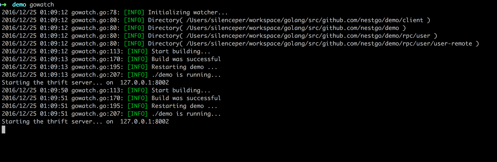

# gowatch

Go 程序热编译工具，提升开发效率

通过监听当前目录下的相关文件变动，进行实时编译


### 安装使用

```go
go install github.com/silenceper/gowatch
``` 

安装完成之后，即可使用`gowatch`命令，在当前文件执行:



当文件变动会重新编译并执行。

### 相关配置

大部分情况下，不需要更改配置，直接执行`gowatch`命令就能满足的大部分的需要，但是也提供了一些配置用于自定义，在执行目录下创建`gowatch.yml`文件，支持的配置如下：

```
# gowatch.yml 配置示例

# 当前目录执行下生成的可执行文件的名字，默认是当前目录名
appname: "test"   
# 是否对当前目录下相关依赖执行 ‘go install’命令，将会执行安装依赖
go_install: true
# 需要监听的文件名后缀，默认只有'.go'文件
watch_exts:
    - .yml
# 在执行命令时，需要增加的其他参数
cmd_args:
    - arg1=val1
# 需要增加环境变量，默认已加载当前环境变量
envs:
    - a=b
# 是否监听 ‘vendor’ 文件夹下的文件改变
vendor_watch: false
# 不需要监听的目录名字
excluded_paths:
    - path
# build tags
build_tags: ""

```


>该项目参考 beego/bee 项目中的bee run 实现